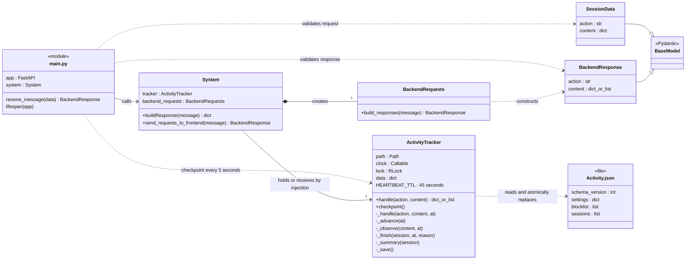
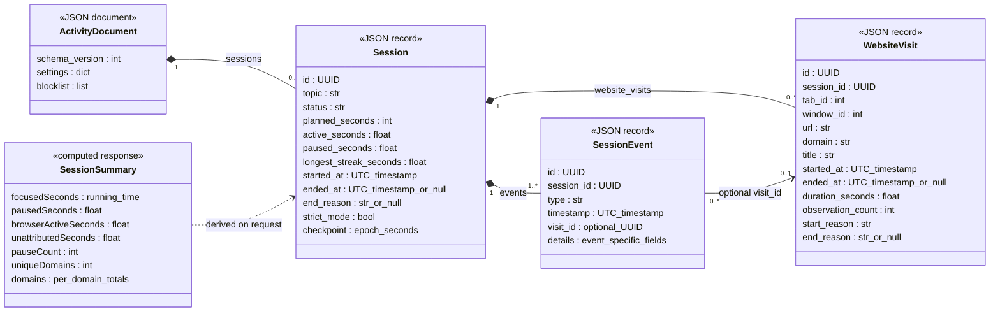
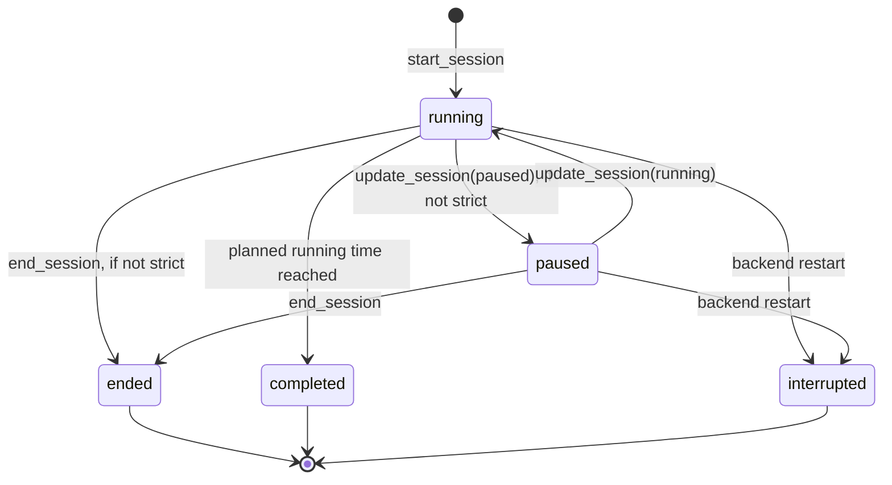

# Backend UML — current implementation

This describes the working tree as of 8 September 2026, including the session-tracking changes. It documents the code that actually runs, rather than a proposed architecture. Start with the class diagram, then follow the request sequence and stored-data model.

The editable version is [BackendUML.drawio](BackendUML.drawio). The [class diagram SVG](BackendUML.svg) can be opened directly in a browser or inserted into a report. The diagrams below render in Markdown viewers that support Mermaid.

## 1. Classes and responsibilities



`main.py` and `Activity.json` are shown with stereotypes because they are a module and a file, not Python classes. Method types are explanatory where the source does not declare annotations. `+` indicates a public method; `-` indicates an underscore-prefixed implementation helper, not enforced Python access control. Only the methods needed to explain the design are shown.

| Source | Responsibility |
| --- | --- |
| [main.py](../main.py) | HTTP endpoint, Pydantic validation, error translation, and the periodic checkpoint task. |
| [System](../System/System.py) | Keeps the frontend's existing action/content protocol and delegates work. |
| [SessionData / BackendResponse / BackendRequests](../System/BackendRequests.py) | Request and response schemas, plus response construction. Lists are allowed in responses because session history is a collection. |
| [ActivityTracker](../UserSession/ActivityTracker.py) | Session transitions, elapsed-time accounting, website observations, queries, settings, and JSON persistence. |
| `DataBase/Activity.json` | Durable state for the new tracker. Created when state is first saved and excluded from Git. |

`System` can receive a tracker through its constructor, which allows tests to use a temporary database and a controlled clock. Its tracker relationship is therefore an association, rather than unconditional composition.

## 2. Request and persistence sequence

```mermaid
sequenceDiagram
    actor User
    participant Popup as Extension popup
    participant API as main.py / FastAPI
    participant System
    participant Tracker as ActivityTracker
    participant File as Activity.json
    participant Worker as Extension service worker

    User->>Popup: Start a session
    Popup->>API: POST /backend (start_session, topic, minutes)
    API->>API: Validate SessionData
    API->>System: buildResponse(message)
    System->>Tracker: handle(action, content)
    Note over Tracker: Acquire RLock; copy previous state
    Tracker->>Tracker: _advance(now), then _handle(...)
    Tracker->>Tracker: Validate duration; create UUID and started event
    Tracker->>File: _save(): write temporary file, fsync, replace
    Note over Tracker: Release lock; return a copy
    Tracker-->>System: Session data
    System-->>API: action/content response
    API->>System: send_requests_to_frontend(response)
    System-->>API: BackendResponse via BackendRequests
    API-->>Popup: HTTP 200 with session ID and timer state
    Popup->>Worker: SESSION_START notification

    loop Browser event or roughly 30-second heartbeat
        Worker->>API: get_active_session
        API->>System: Dispatch request
        System->>Tracker: handle(get_active_session, ...)
        Tracker-->>System: Current session or no running session
        System-->>API: Response
        API-->>Worker: Current session state
        alt Matching running session exists
            Worker->>Worker: Check focused window, idle state and active tab
            Worker->>API: log_meta_data with session_id and event_id
            API->>System: Dispatch observation
            System->>Tracker: handle(log_meta_data, ...)
            Tracker->>Tracker: Verify session; deduplicate; update visit interval
            Tracker->>File: Save changed state
            Tracker-->>System: stored / reason
            System-->>API: Response
            API-->>Worker: Observation result
        else Session absent or paused
            Note over Worker: Do not send website details
        end
    end

    Note over API,File: Independently, the lifespan task calls checkpoint() every 5 seconds.
    Note over Tracker,File: It advances the timer, expires stale visits, completes due sessions and saves state.
```

The periodic task uses a worker thread for the synchronous checkpoint call. Both API mutations and checkpoints use the same in-process lock. A session therefore continues to run and can complete without an open popup.

For API requests, a `ValueError` becomes HTTP 400; invalid request shapes produce HTTP 422. Failed tracker requests restore their previous in-memory state. Unexpected failures are not turned into a fabricated successful response. There is no distributed transaction or multi-process file lock: run one backend worker against a given activity file.

## 3. Stored data model

These are conceptual UML data types represented by nested JSON dictionaries and lists. **They are not additional Python classes or database tables.**



The fields above are a selected overview. Visits also retain favicon URLs, initial audible/pinned flags, last-observation timestamps, and accounting markers. Events have fields specific to their type, rather than an actual nested property named `details`.

## 4. Session state machine



Only one session can be running or paused at a time. Paused time does not consume the planned duration. A strict session cannot be paused or ended early. On process restart, unfinished sessions are marked interrupted at their last durable checkpoint; the offline gap is not added to their duration.

## Explanation

The concrete problem was that the prototype saved session starts and unrelated website metadata, but did not implement complete pause/end handling or trustworthy per-session history. The current implementation keeps the frontend's action/content API while linking visits and events with session UUIDs, making timing state durable, and providing history/export responses.

The persistence operations are concentrated in `ActivityTracker` so a session transition and its timeline/visit updates can be saved together. A single JSON document avoids independently updating session and metadata files for one logical change. A bounded observation interval prevents a vanished browser worker from accumulating unlimited website time.

This has a tradeoff: `ActivityTracker` currently combines lifecycle rules, queries, and storage. It is suitable for this single-user prototype but is not a fully separated service/repository architecture. A later refactor could extract storage and reporting behind interfaces while preserving the API and tests. The diagram deliberately does not invent those layers.

The older `UserSessionManager`, `SessionStart`, `ActiveUserSession`, `UserSessionDataManager`, `DataManager`, `PastSessionManager`, `Settings`, and abstract interfaces still exist in the repository but are not used by the current `main.py → System → ActivityTracker` execution path. The earlier [Backend LockDown.drawio](Backend%20LockDown.drawio) is preserved as historical design context.

Validation: [tests/test_activity.py](../tests/test_activity.py) covers lifecycle timing, foreground attribution, heartbeat gaps, duplicate observations, strict mode, restart recovery, input validation, and concurrent requests. Timing limitations and API details are documented in [ActivityTracking.md](ActivityTracking.md).
