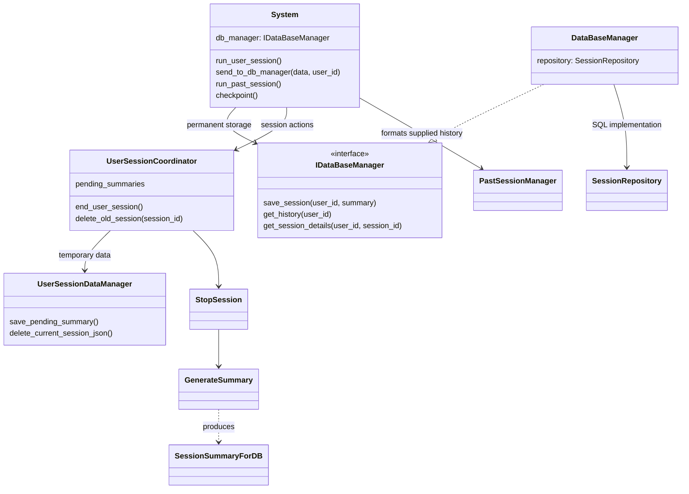
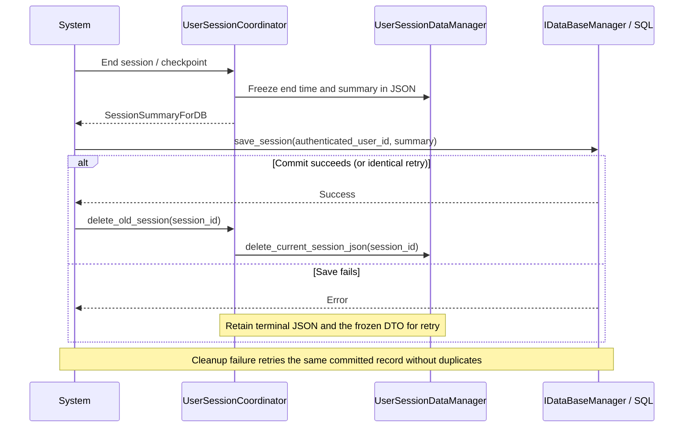

# Backend UML: team summary integration

Reviewed against `feature/sql-summary-integration`, based directly on the colleague's `feature/StopSession` commit **bb5b28d**, on 15 September 2026. The earlier SQL implementation is preserved in local recovery commit **07dd303** on `backup/sql-before-team-summary-20260915`.

- [Seven-page visual walkthrough](BackendUML.html)
- [Shareable PDF](BackendUML.pdf)
- [Editable diagrams.net source](BackendUML.drawio)
- [Overview SVG](BackendUML.svg)
- [Database interface and DTO contract](DatabaseInterface.md)
- [Setup, migration, and validation](SessionStorage.md)

The supplied `Backend LockDown.drawio` establishes the responsibility boundary. Its database methods were placeholders; this implementation defines those methods without changing the `SessionSummaryForDB` fields.

| Page | What it explains |
| --- | --- |
| [Overview](uml/overview.svg) | System coordinates independent temporary and permanent storage components. |
| [Classes](uml/classes.svg) | Concrete interfaces, session coordinator, DTO, and SQL repository. |
| [Finalization](uml/finalization.svg) | Durable summary, SQL commit, then session-owned cleanup. |
| [SQL mapping](uml/sql-model.svg) | Exact DTO fields preserved alongside existing records. |
| [States](uml/states.svg) | Ended/pending/saved and checkpoint-based restart behavior. |
| [History and AI](uml/history-ai.svg) | Shared owner-scoped SQL reads and optional analysis. |
| [Integration and migration](uml/migration.svg) | Branch base, recovery snapshot, and preserved legacy data. |

`main.py` remains the HTTP adapter. The session coordinator uses the team's timing/metadata/summary components. `UserSessionDataManager` owns temporary JSON. `DataBaseManager` receives summary data only and never reaches into the session component. `SessionRepository` retains the existing schema and scoped queries. The older JSON `DataManager` remains an unused prototype for old imports. The previous `ActivityTracker` implementation is not on this branch's application path.

History and Past Sessions show only the statistics supplied by the DTO for new records. Older detailed archives retain visit/timeline exports. The team's evaluator remains a stub; neither stored scores nor test analysis fixtures establish a live AI integration. Summary-only records cannot supply detailed visits to an AI consumer.

Regenerate editable pages, SVGs, and HTML with `python Documents/generate_backend_uml.py`. This generator encodes the reviewed architecture; it does not discover the code automatically. Re-export the PDF after model changes. The generated pages were checked for XML validity and browser-rendered text bounds, and the presentation was visually inspected.
